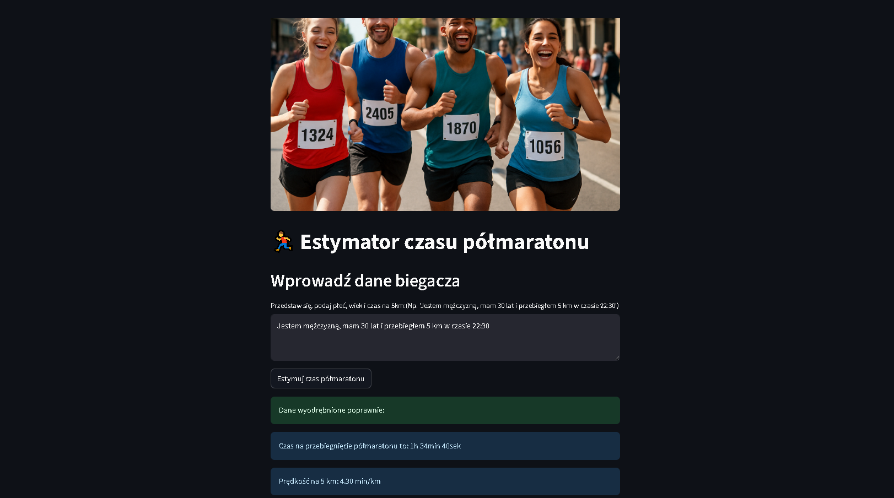

# 🏃 Half Marathon Time Estimator

## Application Description
This is an intelligent web application that uses machine learning to predict half marathon (21.097 km) completion time based on runner data. The application combines advanced AI/ML technologies with a user-friendly interface.


*Application interface – the user can describe themselves naturally, and the AI will automatically extract key information*

## 🛠️ Technologies Used

**Frontend & Framework:**
- **Streamlit** – main framework for building the web interface
- **HTML/CSS** – styling and layout

**Backend & AI/ML:**
- **Python 3.8+** – main programming language
- **PyCaret** – library for automating machine learning
- **Gradient Boosting Regressor** – ML model for time prediction
- **OpenAI GPT-3.5-turbo** – Large Language Model for natural language processing

**Cloud & Storage:**
- **Digital Ocean Spaces** – storage for the ML model and resources
- **Boto3** – AWS S3 client for communication with Digital Ocean Spaces
- **Langfuse** – monitoring and metrics for LLM

**Data Processing:**
- **Pandas** – data manipulation and analysis
- **NumPy** – numerical computations

**Configuration & Security:**
- **Python-dotenv** – environment variable management
- **Environment variables** – secure storage of API keys

## 🚀 Main Application Features

#### **Intelligent natural language processing**
   - The user describes themselves naturally (e.g., "I am a man, I am 30 years old and I ran 5 km in 22:30")
   - The LLM automatically extracts key information: gender, age, 5 km time

#### **Automatic ML model download**
   - The model is always up to date – downloaded from the cloud at each launch
   - No need to manually update the model locally

#### **Half marathon time prediction**
   - The ML model analyzes the input data and predicts the half marathon completion time
   - The result is presented in a readable format (hours, minutes, seconds)

#### **Intelligent time format conversion**
   - Supports various time input formats (mm:ss, minutes seconds, number of minutes)
   - Automatic conversion to the format required by the model

#### **Monitoring and metrics**
   - Integration with Langfuse for tracking LLM performance
   - Collecting data on the quality of natural language processing

#### **Error handling and validation**
   - Checking completeness of input data
   - Clear error messages and missing information alerts

## 💡 Example usage
```
User enters: "I am a woman, I am 28 years old, and my 5km time is 25 minutes"

Application:
1. Extracts: gender=0 (female), age=28, 5km_pace=5.0 min/km
2. Passes data to the ML model
3. Returns the predicted half marathon time
4. Displays the result in the format "2h 15min 30s"
```

## 🔧 Architecture
- **Modular structure** with separate functions for each task
- **Langfuse decorators** for monitoring LLM performance
- **Secure API key management** via environment variables
- **Automatic deployment** via Digital Ocean App Platform

## 🎯 Business Value
This application demonstrates advanced integration of various AI/ML technologies in a practical solution, combining natural language processing with machine learning prediction. It is an example of real-world AI application in sports and health, showing how data can be used for personalization and training optimization.

## 🔗 Links
- **🚀 App demo:** [https://maratonik-app-hnu3v.ondigitalocean.app/](https://maratonik-app-hnu3v.ondigitalocean.app/)
- **🐙 Source code:** [https://github.com/cptzbik/halfmaraton](https://github.com/cptzbik/halfmaraton)


